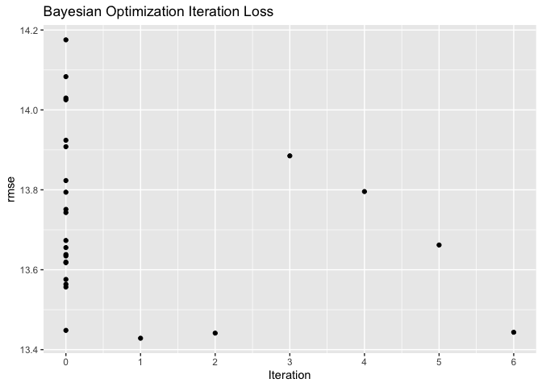
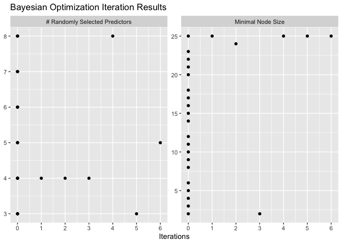
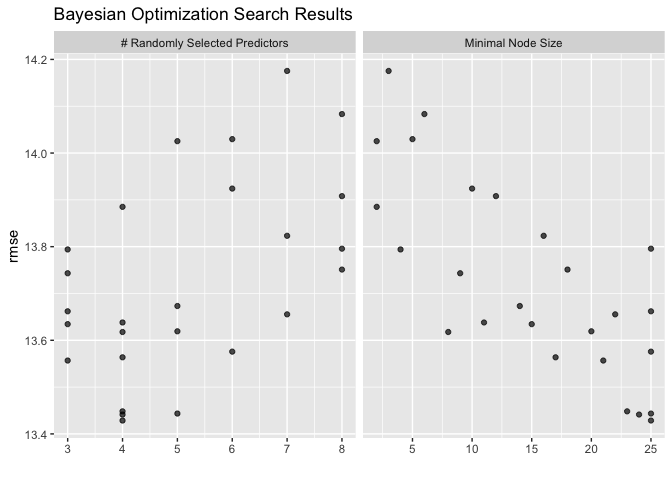
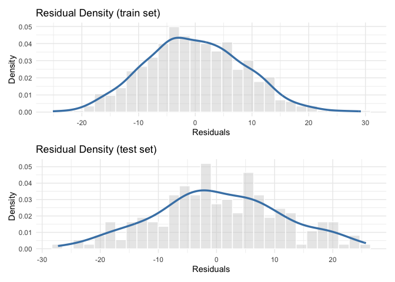

<!-- README.md is generated from README.Rmd. Please edit that file -->

# TidyML

<!-- badges: start -->
<!-- badges: end -->

TidyML is a minimalistic library specifically designed to make the
estimation of Machine Learning (ML) techniques as easy and accessible as
possible, particularly within the framework of the Knowledge Discovery
in Databases (KDD) process in data mining. The package provides all the
essential tools needed to efficiently structure and execute each stage
of a predictive or classification modeling workflow, aligning closely
with the fundamental steps of the KDD methodology, from data selection
and preparation, through model building and tuning, to the
interpretation and evaluation of results using Sensitivity Analysis. The
TidyML workflow is organized into five core steps; preprocessing(),
build_model(), fine_tuning(), show_results(), and
sensitivity_analysis(). These steps correspond, respectively, to data
preparation and transformation, model construction, hyperparameter
optimization, results presentation, and sensitivity analysis. By
streamlining these phases, TidyML aims to simplify the implementation of
ML techniques, allowing analysts and data scientists to focus on
extracting actionable insights and meaningful patterns from large
datasets, in line with the objectives of the KDD process.

## Installation

You can install the development version of TidyML from
[GitHub](https://github.com/) with:

``` r
# install.packages("pak")
pak::pak("JMartinezGarcia/TidyML")
```

## Example

This is a basic example which shows you how to solve a common problem:

``` r
library(TidyML)
## basic example code

formula_reg <- "psych_well ~ age + gender + socioec_status + emot_intel + depression"

analysis_object <- preprocessing(sim_data, formula_reg, task = "regression") %>%

                   build_model(model_name = "Random Forest",
                                       hyperparameters = list(trees = 150)) %>%

                   fine_tuning(tuner = "Bayesian Optimization", metrics = "rmse",
                               plot_results = T) %>%

                   show_results(summary = T, scatter_residuals = T, scatter_predictions = T,
                                residuals_dist = T) %>%
   
                   sensitivity_analysis(methods = c("PFI", "SHAP"), 
                                        metric = "rsq")
#> Commencing Tuning...
#> ! No improvement for 5 iterations; returning current results.
#> Tuning Finalized 
#> ######## Hyperparameter Tuning Results ##########
```



    #> ####### Best Hyperparameters Found #######
    #> # A tibble: 1 × 9
    #>    mtry min_n .metric .estimator  mean     n std_err .config               .iter
    #>   <int> <int> <chr>   <chr>      <dbl> <int>   <dbl> <chr>                 <int>
    #> 1     6    25 rmse    standard    13.8     5   0.238 Preprocessor1_Model13     0
    #> 
    #> ############# Showing Results ############# 
    #> ###### Summary ###### 
    #> 
    #>       RMSE      MAE MAPE  MPE       CCC    SMAPE     RPIQ       RSQ
    #> 1 13.60194 11.02878  Inf -Inf 0.8124794 29.10788 2.407744 0.6808136



    #> ######### PFI Method Results ############## 
    #> 
    #> # A tibble: 8 × 3
    #>   Variable              Importance    StDev
    #>   <chr>                      <dbl>    <dbl>
    #> 1 depression              0.654    0.0180  
    #> 2 emot_intel              0.0973   0.0155  
    #> 3 socioec_status_Medium   0.00187  0.000923
    #> 4 socioec_status_Low      0.000745 0.000755
    #> 5 gender_Female           0.000313 0.000820
    #> 6 gender_Male            -0.000954 0.000714
    #> 7 socioec_status_High    -0.00238  0.00153 
    #> 8 age                    -0.00684  0.00545


    #> 
    #> ── Starting `shapr::explain()` at 2025-05-27 12:17:20 ──────────────────────────────────────────────────────────────────
    #> ℹ You passed a model to `shapr::explain()` which is not natively supported, and did not supply a `get_model_specs`
    #>   function to `shapr::explain()`.
    #>   Consistency checks between model and data is therefore disabled.
    #> 
    #> 
    #> ── Explanation overview ──
    #> 
    #> 
    #> 
    #> • Model class: <_ranger/model_fit>
    #> 
    #> • Approach: empirical
    #> 
    #> • Iterative estimation: TRUE
    #> 
    #> • Number of feature-wise Shapley values: 8
    #> 
    #> • Number of observations to explain: 250
    #> 
    #> • Computations (temporary) saved at:
    #> '/var/folders/x5/8z0mshcj4gb4__ckxrrmpg480000gn/T//RtmprVV1vb/shapr_obj_81baf49c618.rds'
    #> 
    #> 
    #> 
    #> ── iterative computation started ──
    #> 
    #> 
    #> 
    #> ── Iteration 1 ─────────────────────────────────────────────────────────────────────────────────────────────────────────
    #> 
    #> ℹ Using 26 of 256 coalitions, 26 new. 
    #> 
    #> 
    #> 
    #> ── Iteration 2 ─────────────────────────────────────────────────────────────────────────────────────────────────────────
    #> 
    #> ℹ Using 40 of 256 coalitions, 14 new.
    #> ######### SHAP Method Results ############## 
    #> 
    #>                       Importance StDev
    #> depression                14.400 0.610
    #> emot_intel                 6.360 0.350
    #> age                        1.530 0.065
    #> socioec_status_Medium      0.684 0.027
    #> gender_Female              0.597 0.030
    #> socioec_status_High        0.550 0.024
    #> socioec_status_Low         0.419 0.025
    #> gender_Male                0.305 0.016


